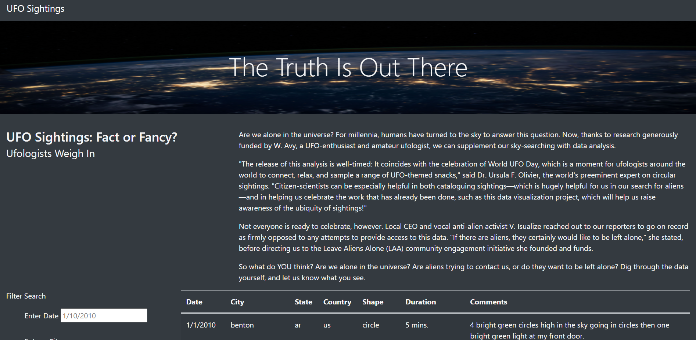
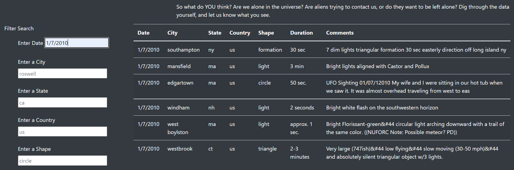
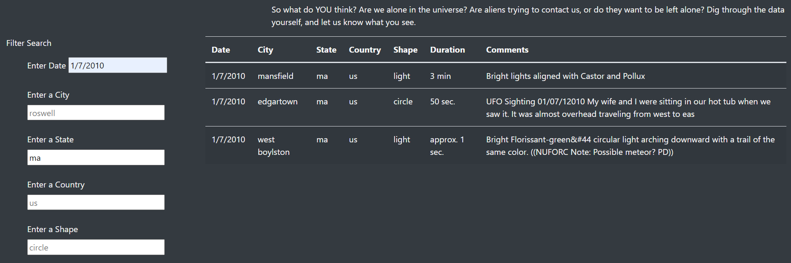
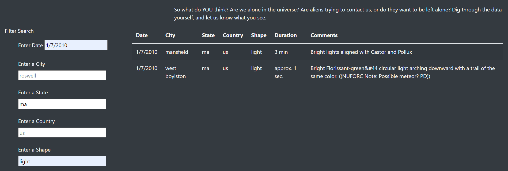
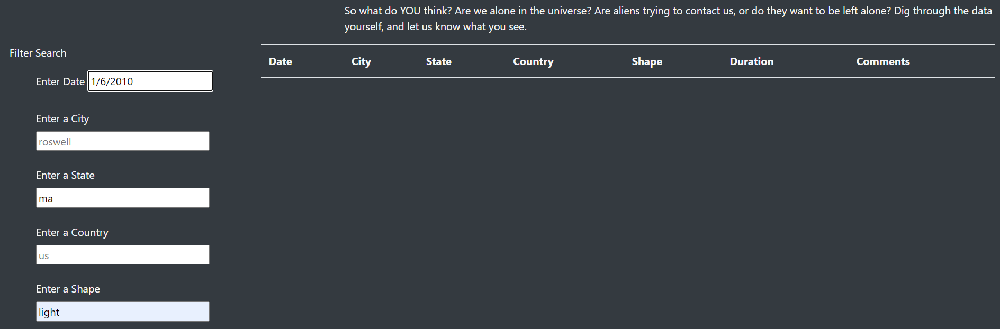

# **UFO Sightings with JavaScript**

## **Overview of UFOs Analysis** 

* Dana, a data journalist who is at a point in her career where she had the freedom to choose the topics she wants to write about. She is given the opportunity to write about her hometown McMinnville, Orogen. UFOs if the topic Dana has been interested in since she was a child. The data she needs is in JavaScript file. 

* we will help Dana build a table using data stored in a JavaScript array and place it into an HTML file for easy viewing. We will create a website page that has her article and the whole table displayed as a default. We will also create a filter by date and Users should be able to filter the table by entering the date and clicking the search button.

* In this challenge. we should modify the code from the module to add more table filters for the city, state, country, and shape in addition to the date. This should make the table more dynamic and flexible to use.

### Purpose
 
* Filter UFO sightings table on multiple criteria (city, state, country and shape) in addition to the date filter. As well deploy the webpage to github. As well to create a summary report based on the UFOs analysis and how search filters work.
 

## **Results** 
# Website Article and title

# filter by date July

* As we see from image above, the website has a title, an article filters on the left and whole table loaded as default on the right. Below the article onto the left under "Filter Search" we have five filters. Under the article onto the right is the table. Users should be able to filter by one, two, three, four or all the filters by typing the filter and clicking "enter". E.g., in the above image we are filtering by date "July”, enter the date and click enter. The table will be filtered to show only data for the month of July.

# filter by date July and by state

# filter by date July and by state and shape

* As we can see from the images above, if you want to filter the result more, by state then you type the state and click enter. The filtered table will be displayed onto the right. If you want to filter the result more, by shape for example then you type the shape and click enter. The filtered table will be displayed onto the right.

* If you decide you want to filter only by date and state from previous example, delete the shape filter and click enter but keep the date and state. The filtered table will be displayed. As well if you want to filter only by date, keep the date and delete other filters(state and shape in this example). The filtered data for the date will be displayed.

## **Summary** 

* one drawback of this new design is users can not search by range of dates, for example if you want to see data from July to september, the filter for date will not allow us to do that. They have to search each month separately. 

* also, currently the user types the filters on the input boxes. It is easy for the user to make mistakes when typing. we can add drop downs of the filters (Date, city, State, Country and Shape) instead of the input boxes. The user does not have to type anything, they can select the filters. This makes the website more user friendly and flexible.
 
* two recommendations for further development
* As I mentioned we can update the Date filter so we have two input boxes for date, start date and end date. This will help users to filer the table for different months once. 

# filter by date June

* from the previous example the user was filtering by Date, state and circle. if they decided filter by another date for the whole table, then if they only change the date and click enter, the results displayed will also be filtered by the state and shape from the previous search. check the image above. So, the user has to delete the state(ma) and shape(circle) and hit enter for the correct filtered data to be displayed. To make it easier and we need to add a Reset button so that the user does not have to delete all filters added if new search is required. 

